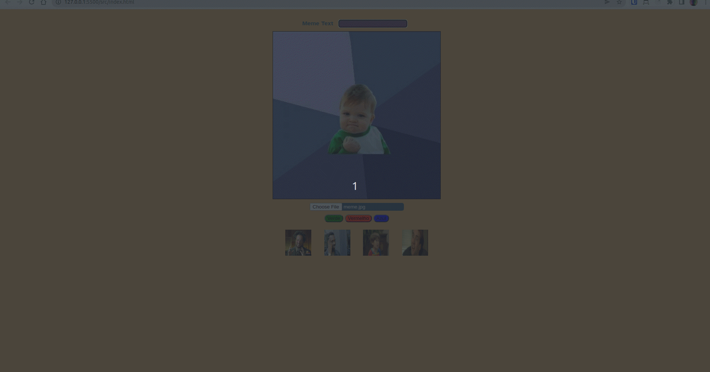

## O que é o projeto Trybe Meme Generator

Para este projeto, tive que desenvolver um gerador de memes utilizando HTML, CSS e Javascript, com o intuíto de aprofundar meus conhecimentos com manipulação do DOM. 

A aplicação permite que a pessoa usuária selecione uma imagem, ou escolha um dos templates oferecidos e digite um texto que irá servir de legenda para o meme. 

## Exemplo: 

